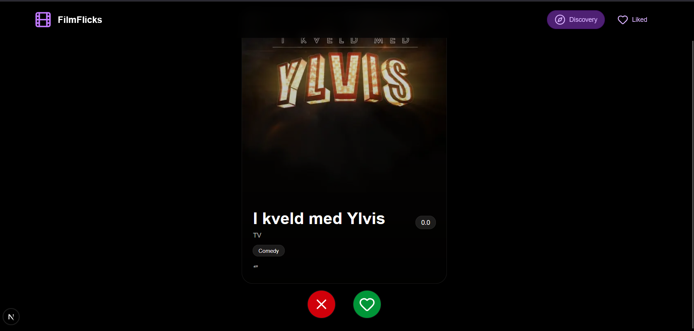
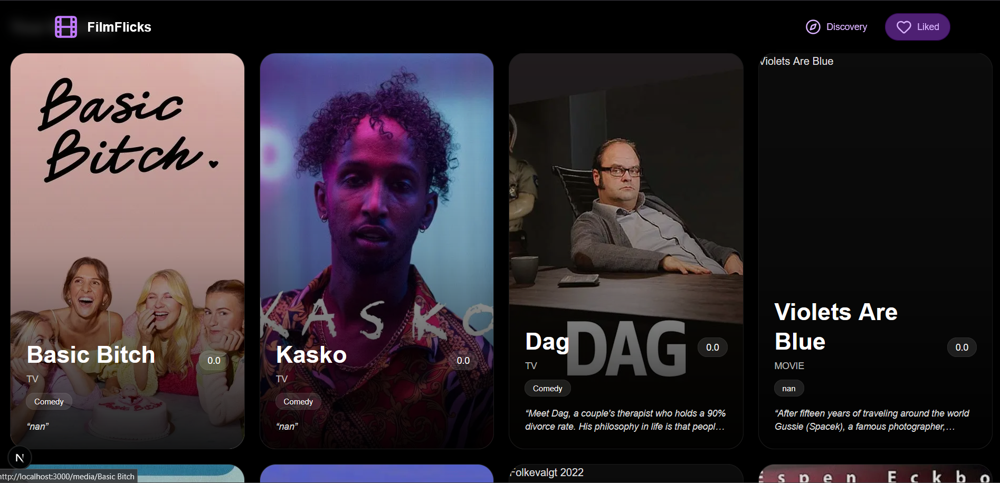

# 447-movies-shows-anime-swipe
# FilmFlicks – Movie, TV, and Anime Discovery App

FilmFlicks is a swipe-based media discovery web application that helps users find movies, TV shows, and anime tailored to their preferences. Users can like or dislike recommendations, and the system adapts to provide better suggestions over time.

# Features

- Swipe-style Discovery

- Like or dislike media items similar to Tinder-style interaction

- Personalized Recommendations

- Backend recommendation system updates based on user feedback

# Dynamic Content

- Fetches and displays media including:

- Title

- Genres

- Poster images

- Overview/description

# Persistent Feedback

- Likes and dislikes are stored in a database for future recommendations

# Tech Stack

Frontend

    - Next.js

    - TypeScript

    - Tailwind CSS

Backend

    - FastAPI

    - Python

Database

    - SQLite

# Setup Instructions

## 1. Clone the Repository
``` bash
git clone https://github.com/phenry3/447-movies-shows-anime-swipe.git
cd  447-movies-shows-anime-swipe
```

## 2. Backend Setup
cd backend

- Create virtual environment
python -m venv venv

- Activate (Windows)
venv\Scripts\activate

- Install dependencies
pip install -r requirements.txt

- Run server
uvicorn api_server:app --reload

## 3. Frontend Setup
cd frontend

- Install dependencies
npm install

- Start development server
npm run dev

- Create a .env.local file in the frontend root with the following variable:
NEXT_PUBLIC_BACKEND_URL=http://127.0.0.1:8000

# Demo


